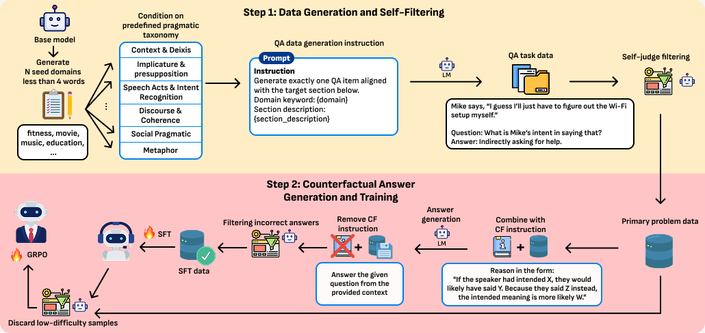

# PragReST: Self-Reinforcing Counterfactual Reasoning for Pragmatic Language Understanding

[](https://arxiv.org/abs/2606.18624)
[](https://huggingface.co/minchaoh2002/Qwen3-8B-PragReST)
[](https://huggingface.co/minchaoh2002/Qwen3-14B-PragReST)

[Jihyung Park](https://jihyung803.github.io/) | [Minchao Huang](https://www.linkedin.com/in/minchao-huang/) | [Leqi Liu](https://leqiliu.github.io/) | [Elias Stengel-Eskin](https://esteng.github.io/)

## Overview

This repository contains the release code for **PragReST**, including the pragmatic QA data-generation pipeline, filtering and auditing utilities, SFT and GRPO training scripts, and evaluation code for PragMEGA, LUDWIG, MetoQA, and AltPrag.

**PragReST** is a self-supervised framework for improving pragmatic language understanding through self-reinforcing counterfactual reasoning. It constructs pragmatic QA data, filters generated examples with self-auditing, generates counterfactual reasoning traces for supervised fine-tuning, and further optimizes models with GRPO.

Large generated datasets, logs, local caches, and private environment files are intentionally not included in this repository.

<p align="center">
  
</p>


## Repository Contents

This repository includes:

* pragmatic QA data generation;
* automatic auditing and filtering of generated examples;
* SFT data construction with counterfactual reasoning traces;
* SFT training with LoRA or full fine-tuning;
* GRPO preprocessing, prompt filtering, and reward computation;
* evaluation on PragMEGA, LUDWIG, MetoQA, and AltPrag;
* AltPrag pairwise evaluation with a GPT-4.1-compatible judge.

The main directories and files are:

| Path               | Description                                                                                                                   |
| ------------------ | ----------------------------------------------------------------------------------------------------------------------------- |
| `scripts/`         | Entry-point scripts for data generation, filtering, SFT data construction, training, and evaluation                           |
| `src/`             | Core implementation code, including evaluation backends, GRPO preprocessing utilities, prompt filtering, and reward functions |
| `configs/`         | Example configuration files for the PragReST pipeline                                                                         |
| `results/`         | Default output location for evaluation results                                                                                |
| `paper/`           | Paper PDF and release material                                                                                                |
| `filter.slurm`     | Optional SLURM template for rollout-based prompt filtering                                                                    |
| `train_grpo.slurm` | Optional SLURM template for GRPO training                                                                                     |

## Setup

```bash
python -m venv .venv
source .venv/bin/activate
pip install -r requirements.txt
```

Optional backends:

* `EVAL_BACKEND=transformers` uses Hugging Face Transformers directly.
* `EVAL_BACKEND=vllm` uses local vLLM inference.
* `EVAL_BACKEND=sglang` uses local SGLang inference.

AltPrag scoring and optional PragMEGA extraction fallback require an OpenAI-compatible API key if enabled:

```bash
export OPENAI_API_KEY=...
```

## Evaluation

All evaluation scripts accept a model through `EVAL_MODEL_SPEC`. This can be a Hugging Face model id, a local model path, or a JSON model spec supported by `src/eval/vllm_boxed_mcqa.py`.

### PragMEGA

Deterministic Transformers evaluation:

```bash
export EVAL_MODEL_SPEC=Qwen/Qwen3-8B
export EVAL_BACKEND=transformers
export TRANSFORMERS_EVAL_DETERMINISTIC=1
export TRANSFORMERS_EVAL_DTYPE=bfloat16
export TRANSFORMERS_EVAL_ATTN_IMPL=eager
export TRANSFORMERS_EVAL_BATCH_SIZE=1
export PRAGMEGA_DO_SAMPLE=0
python scripts/eval_pragmega.py
```

PragMEGA expects `PRAGMEGA_DATA_PATH` to point to the local PragMEGA prompt directory. By default it looks for:

```text
data/eval/prompts/selected
```

### LUDWIG

LUDWIG downloads its public CSV files from the upstream repository by default:

```bash
export EVAL_MODEL_SPEC=Qwen/Qwen3-8B
export EVAL_BACKEND=transformers
python scripts/eval_ludwig.py
```

### MetoQA

```bash
export EVAL_MODEL_SPEC=Qwen/Qwen3-8B
export EVAL_BACKEND=transformers
export METOQA_DATA_PATH=data/eval/metoqa/metoqa.jsonl
python scripts/eval_metoqa.py
```

### AltPrag

```bash
export EVAL_MODEL_SPEC=Qwen/Qwen3-8B
export EVAL_BACKEND=transformers
python scripts/eval_altprag.py
```

### AltPrag pairwise comparison

```bash
python scripts/eval_altprag_pairwise.py \
  --comparison "model_a_vs_model_b=results/altprag_outputs/MODEL_A_seed1.jsonl::results/altprag_outputs/MODEL_B_seed1.jsonl" \
  --output-dir results/altprag_pairwise/model_a_vs_model_b \
  --judge-model gpt-4.1 \
  --judge-temperature 0
```

## PragReST Pipeline

The pipeline has four Python stages:

1. Generate pragmatic QA examples.
2. Audit and filter generated examples.
3. Build SFT data with reasoning traces.
4. Train with LoRA or full fine-tuning.

The main entry points are:

```bash
python scripts/run_pragrest_pipeline.py --help
python scripts/build_pragmatic_qa_domain_sessions.py --help
python scripts/audit_pragmatic_generated_data.py --help
python scripts/build_pragmatic_sft_dataset_star.py --help
python scripts/train_pragmatic_sft_lora.py --help
python scripts/train_pragmatic_sft_full.py --help
```

`configs/pragmatic_pipeline.example.yaml` documents the parameters used by these stages. To inspect the translated commands without running expensive generation or training:

```bash
python scripts/run_pragrest_pipeline.py \
  --config configs/pragmatic_pipeline.example.yaml \
  --only data_generation,audit,sft_data_generation,train \
  --dry-run
```

Enable the stages you want in the YAML, then run the same command without `--dry-run`.

## VERL / GRPO

The GRPO path uses VERL-format Parquet data and a separate VERL environment.

Build QA Parquet files from audited PragReST JSONL with:

```bash
python src/data_preprocess_verl_mixed.py \
  --qa_input data/processed/pragrest_qa_audited.jsonl \
  --output data/verl-mixed-qwen-8b
```

To build a single file for rollout-based filtering:

```bash
python src/data_preprocess_verl_mixed.py \
  --qa_input data/processed/pragrest_qa_audited.jsonl \
  --output data/verl-mixed-qwen-8b \
  --no_split
```

`src/filter_prompts.py` removes prompts that are too easy for GRPO, and can also remove prompts where no sampled rollout succeeds:

```bash
python src/filter_prompts.py \
  --input data/verl-mixed-qwen-8b/all.parquet \
  --output data/verl-mixed-qwen-8b/no_easy_no_hard/all_filtered.parquet \
  --base_url http://localhost:8200 \
  --model_name policy \
  --judge_base_url http://localhost:8300 \
  --judge_model_name judge \
  --n_samples 8 \
  --filter_hard
```

The helper scripts `src/build_easy_only_from_filter_stats.py` and `src/split_filtered_parquet.py` derive the easy-only variant and split filtered Parquet files into train/validation sets. `src/reward_fn.py` provides the VERL reward function used by the GRPO template.

`filter.slurm` and `train_grpo.slurm` are optional cluster templates. They intentionally avoid user names, account names, emails, and absolute home paths; configure them through environment variables such as `PRAGREST_REPO_DIR`, `VERL_SETUP_DIR`, `WORK`, `SCRATCH`, `BASE_MODEL`, `SFT_MODEL_DIR`, `DATA_DIR`, and `REWARD_FN_PATH`.

## Results

Evaluation outputs are written under `results/` by default. Override with:

```bash
export EVAL_RESULTS_ROOT=/path/to/results
```

A typical evaluation directory contains model generations, extracted predictions, benchmark scores, and metadata needed for later aggregation. AltPrag pairwise outputs are written separately under `results/altprag_pairwise/`.


## License

The code in this repository is released under the CC BY 4.0 License.


## Bibtex
```
@article{park2026pragrest,
      title={PragReST: Self-Reinforcing Counterfactual Reasoning for Pragmatic Language Understanding},
      author={Park, Jihyung and Huang, Minchao and Liu, Leqi and Stengel-Eskin, Elias},
      year={2026},
      journal={arXiv preprint arXiv:2606.18624},
      url={https://arxiv.org/abs/xxxx.xxxxx},
}
```

